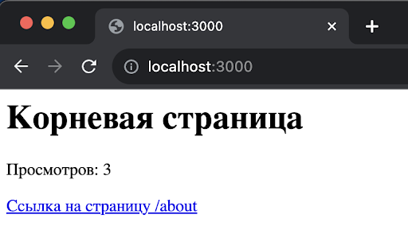
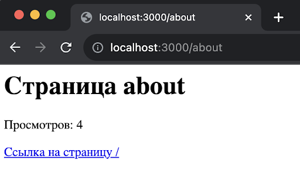

## Урок 3. Модули и фреймворк Express (WIP)

### Задание
Напишите HTTP сервер на express и реализуйте два обработчика “/” и “/about”, где:
* На каждой странице реализован счетчик просмотров
* Значение счетчика необходимо сохранять в файл каждый раз, когда обновляется страница
* Также значение счетчика должно загружаться из файла, когда запускается обработчик страницы
* Таким образом счетчик не должен обнуляться каждый раз, когда перезапускается сервер.

### Подсказка:
Вы можете сохранять файл в формате JOSN, где в объекте ключом будет являться URL страницы, а значением количество просмотров страницы

### Формат сдачи работы:
— Ссылка на гитхаб/гитлаб
— Файл с кодом.